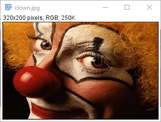
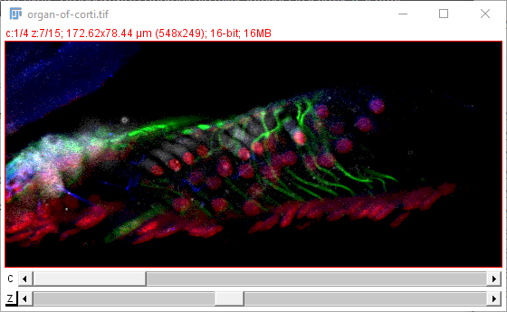
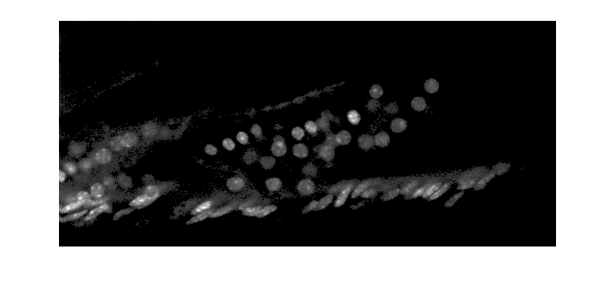

# ImagePlus2array

`ImagePlus2array.m` is a MATLAB function and works with [ImageJ-MATLAB](https://imagej.net/MATLAB_Scripting) to allow you to retrieve an array of image data from ImageJ1 `ij.ImagePlus` object.

This is an alternative of `IJM.getDataset` and` IJM.getDatasetAs` provided by ImageJ-MATLAB.

It supports up to 5D. It does not rely on `IJM` (a `net.imagej.matlab.ImageJMATLABCommands` Java object in the base workspace), so you can easily use this from within a MATLAB function.

Although the computation is slower than  `IJM.getDataset`, because, unlike `IJM.getDataset`, `ImagePlus2array` does not need `imp` to be shown on screen, it can be faster in some cases.


## Syntax

```
I = ImagePlus2array(imp)
```

`imp` ...  `ij.ImagePlus`  object

`I` ... an array of `uint8` or `uint16` integers, can be from2D to 5D.


## Example 1

```
>> imp = ij.IJ.openImage("http://imagej.nih.gov/ij/images/clown.jpg")

imp =
img["clown.jpg" (-2), 24-bit, 320x200x1x1x1]

>> imp.show
>> I = ImagePlus2array(imp);
>> size(I)
ans =
   200   320     3
>> class(I)
ans =
    'uint8'   
>> imshow(I(:,:,1,7))
>> set(gca,'ClimMode','auto')
```




## Example 2


```
>> imp = ij.IJ.openImage("http://imagej.nih.gov/ij/images/organ-of-corti.zip")
imp =
img["organ-of-corti.tif" (-7), 16-bit, 548x249x4x15x1]
>> imp.show
>> I = ImagePlus2array(imp);
>> size(I)
ans =
   249   548     4    15
>> class(I)
ans =
    'uint16'
>> imshow(I(:,:,1,7))
>> set(gca,'ClimMode','auto')

```






Note: There is no simply way of showing >3 channels in MATLAB, so only the first channel is shown.


#### See also

[copytoImagePlus](https://github.com/kouichi-c-nakamura/ijmshow)


### Contacts

Kouichi C. Nakamura, Ph.D.

[kouichi.c.nakamura@gmail.com](mailto:kouichi.c.nakamura@gmail.com)

MRC Brain Network Dynamics Unit, Department of Pharmacology, University of Oxford